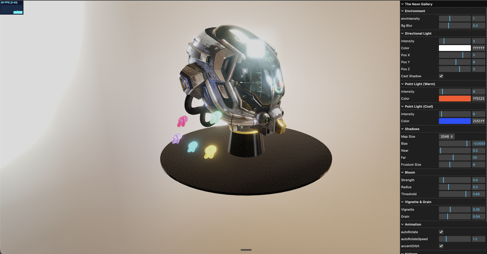

# The Neon Gallery

Three.js 0.170 standalone demo — a Damaged Helmet GLTF model on a reflective pedestal with HDR studio lighting, animated accent objects, and a cinematic post-processing pipeline.



## Quick start

```bash
npm install
npm run dev
```

## Controls

| Action | Input |
|---|---|
| Rotate / zoom | Mouse drag / scroll |
| Auto-rotate | Enabled by default (toggle in GUI) |
| GUI panel | Top-right (lil-gui) |

## GUI

- **Environment** — HDR intensity, background blur
- **Directional Light** — Intensity, color, position, shadows toggle
- **Point Lights** — Warm + cool accent lights with intensity/color
- **Shadows** — Map size (512–4096), bias, frustum, near/far
- **Bloom** — Strength, radius, threshold
- **Vignette & Grain** — Vignette darkening + animated film grain
- **Animation** — Auto-rotate toggle/speed, orbiting accent toggle
- **Helpers** — Light helpers, shadow camera, axes (all off by default)

## Post-processing pipeline

```
RenderPass → UnrealBloomPass → VignetteGrainPass → FXAA → OutputPass
```

## Build

```bash
npm run build    # → dist/
npm run preview  # Preview production build
```
